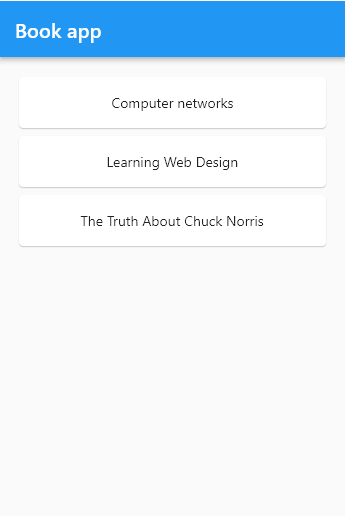

# Exercise E5

Repository for exercise E5.
Course [IDATA2503 Mobile applications](https://www.ntnu.edu/studies/courses/IDATA2503)
at [NTNU](https://ntnu.edu), campus [Aalesund](https://www.ntnu.edu/alesund).

## Intention

The intention is to practice asynchronous programming in the Dart language. Both the syntax and
asynchronous thinking can be challenging at first.

## Theory

Use the theory you got in the Udemy course (Section 9 on Streams) and course lectures. Also, these
sites may be useful:

* [Asynchronous programming](https://dart.dev/codelabs/async-await)
* [Streams](https://dart.dev/tutorials/language/streams)
* [Creating Streams](https://dart.dev/articles/libraries/creating-streams)
* [Very cool StreamBuilder explanation](https://api.flutter.dev/flutter/widgets/StreamBuilder-class.html)
  (See the video on the site)

## Hand-in process

Create a clone of the template repository within GitHub Classroom. Use the invitation link you got
from Blackboard! Get the automated tests passing.

**To pass the assignment approved you need to get at least 80 points.**

## Testing

As always, you can run `flutter test` inside the project folder to run all the tests. As an
alternative, use the testing features in your IDE - right-click on the necessary places, etc. You
know the drill ;)

P.S. Remember how you can run tests in a single test-file? `flutter test test/step_1_1_test.dart`
etc.

P.P.S. It should be possible to run `dart test` instead of `flutter test` as well. The GitHub
Classroom auto-grading pipeline does not work correctly with Dart testing, therefore we
use `flutter test` in auto-grading.

## Instructions

Note: teachers can't update this file after you have created a clone of the assignment repository.
In case some mistakes will be discovered, the latest (fixed) version of the assignment text will be
published in
the [original template repository](https://github.com/NTNU-MobileApps/exercise-e5-template). Use it
to get the most up-to-date description of the assignment!

This assignment consists of three parts:

1. Part 1: `async`, `await` and `Future`
2. Part 2: stream manipulation
3. Part 3: `StreamBuilder` for declarative widgets

It is suggested you place all your implementations of parts 1 and 2 in the file `solutions.dart`.
For part 3 - you must add the code within the `BookApp` widget. You can choose other files, if you
want. Just make sure you refer to the necessary files in the unit tests as well, otherwise the tests
will fail.

See instructions for each part below.

### Part 1

Here you will implement several functions which use the Future class, and keywords `async`
and `await`. Several steps in this part:

* Step 1: Implement an _asynchronous_ function `longOperation()`, which sleeps for 3 seconds. Hints:
    * It must be possible to call your function using `await`, like this: `await longProcessing()`.
    * Your function must return `Future<void>`.
    * You can call the function `sleepSeconds()` which is already provided in the template
      code (`infrastructure/sleep.dart`).
    * If you have done it correctly, you should get the first test
      pass: `flutter test test/step_1_1_test.dart`
* Step 2: Implement an _asynchronous_ function `sleepMilliseconds(milliseconds)` which sleeps (in an
  asynchronous manner) the desired amount of milliseconds. Take a look at `sleepSeconds` function,
  get inspiration from it. Hints:
  The function must return `Future<void>`.
* Step 3: Implement an _asynchronous_ function `Future<int> readTemperature() async` which simulates
  reading of a temperature sensor and returns the value `23` after 200 milliseconds. I.e., it _
  sleeps_ for 200ms, then returns `23`.

### Part 2

In this part you will create a `BookService` class which communicates with an imaginary
database-layer class `BookRepository`. The `BookRepository` class is already provided and complete,
you don't need to change anything in it.

Check out the provided code for the `Book` and `BookReposotiry` classes. `BookRepository` is a
singleton class. Your task is to create the `BookService` class with the following features:

* Step 1: `BookService` must implement singleton patter: it must have a static
  function `getInstance()` which returns the singleton instance of the class. If you did it
  correctly, you should be able to pass the test `flutter test test/step_2_1.test`.
* Step 2: Implement asynchronous method in the `BookService` class: `Stream<Book> getBooks`. It must
  return a stream where _books are received from the database_ (this is a simulation). Hint: you can
  simply return the stream you get from `BookRepository.fetchAllBooks`.
* Step 3: In this step you need to do a transformation on a stream. The stream in Step 2 simply
  returns all the books. In this task you need to return titles for each of the books. I.e.,
  implement a `BookService`
  function `Stream<String> getAllTitles()`. Hints:
    * You can either use the `map` operator on the stream or `await for` loop with `yield`. If you
      use the second option, remember to have `async*` modifier for the function.
    * See the tests in `step_2_3_test.dart` if you are in doubt on how the function will be used and
      what the signature must be.
* Step 4: Implement an _asynchronous_ `BookService`
  method `Stream<Book> searchByTitle(String searchString)` which returns a Book stream - only the
  books whose titles include the given search string (_case-sensitive_ search). See the tests
  in `step_2_4_test.dart` when in doubt of what is expected. Hint: you can either use
  the `await for` with `yield`
  or use the filtering function `where` on the original stream (see
  the [docs for stream modification functions](https://dart.dev/tutorials/language/streams#modify-stream-methods))
  .
* Step 5: BONUS exercise for curious students! Have you wondered whether it is possible to call
  asynchronous functions inside a synchronous
  function? [It is actually possible](https://stackoverflow.com/a/41401506/1703497)! The code
  becomes a bit weird though, because the synchronous function can't wait for the asynchronous
  function to complete. It simply says "hey, let's start this asynchronous operations, and call the
  following callbacks when the results come". The task in this Bonus-step is to create a synchronous
  method `BookService.countBooks()` which initiates counting of the number of books in the
  repository, and calls a provided callback function `onBooksCounted(count)` when the counting is
  done. The `count` parameter for the callback must be the number of books in the library. The
  signature of the method must be `void countBooks(void Function(int) callback)`.
  See `step_2_5_test.dart` to find out how the function will be used. P.S. It is not fun to simply
  return a static constant 3! ;)

### Part 3

In this part you will practice connecting streams to widgets, using `StreamBuilder`. Before you
start banging your head against the wall.... umm... I mean..., writing the code, check
out [this nice video about StreamBuilder in the docs](https://api.flutter.dev/flutter/widgets/StreamBuilder-class.html)
. It shows the main capabilities and use of `StreamBuilder` in 100 seconds!

Your task in this step is to modify the `BookApp` widget and display the real books "from the
database" inside the app. Check out the existing `BookApp` code. It has all the necessary layout,
scaffold, etc. You just need to replace the static `BookItem` widgets with data-based widgets. Use
StreamBuilder for this purpose!

It was a bit tricky to get the previously used book streams to work here (
the `BookService.getBooks()`). To make life easier, there is another Stream available inside
the `BookRepository` - a method called `fetchAllBooksAsAList`. Each item in that stream will be a
whole list of books. In this case, the stream will have only one item in it - the whole list with
all three books in the database.

Your task is to read the `List<Book>` item from the `BookRepository.fetchAllBooksAsAList()` stream,
and show the books inside the `MyBook` widget (as children for the `Column` that is already present
there). P.S. For each book, create a `BookItem` widget.

In the end the app should look something like this:

